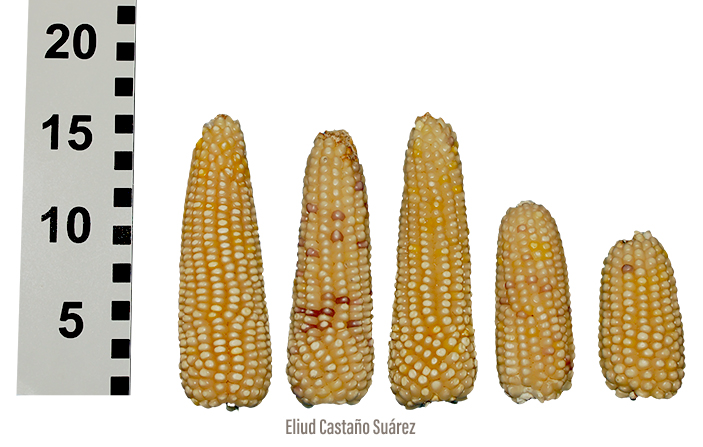

## Cónico

El grupo Cónico incluye varias razas de maíz cuya mazorca presenta una forma cónica o piramidal, como Arrocillo, Cacahuacintle, Negrito, entre otros. La mayoría de estas razas son endémicas de los valles altos y sierras del centro de México, como el Valle de México, el Valle de Toluca, la Sierra Norte de Puebla, la Meseta Purépecha en Michoacán y la Mixteca Alta en Oaxaca. Sus mazorcas tienen entre 14 y 20 hileras de grano y granos de 4 a 8 mm de ancho con textura que varía desde harinosa hasta palomera. Las hojas caen y las vainas presentan antocianina. Algunas razas como Chalqueño, Cónico y Mixteco presentan similitudes morfológicas con los teocintles de la raza Chalco.

El maíz del grupo Cónico es muy importante en la producción agrícola en las zonas del centro de México y se utiliza en la elaboración de productos alimentarios como la tortilla, tamales, antojitos, pozoles y palomitas, entre otros. También se aprovecha la hoja del maíz para tamales y la planta entera para forraje. Este grupo se distribuye en regiones donde también se encuentran poblaciones de teocintle, que representan una importante fuente de flujo genético con el maíz, principalmente en el Valle de Toluca, el oriente y sur del Valle de México y la región central de Puebla. Las similitudes morfológicas entre el maíz del grupo Cónico y los teocintles pueden dificultar la diferenciación entre ambos en los terrenos de cultivo.

[{fig-alt="Muestra de maíz cónico"}](https://www.biodiversidad.gob.mx/diversidad/alimentos/maices/razas/grupo-conico/conico){target="_blank"}

###### Información de CONABIO. 2020. [Grupo Cónico](https://www.biodiversidad.gob.mx/diversidad/alimentos/maices/razas/grupo-conico){target="_blank"}. Comisión Nacional para el Conocimiento y Uso de la Biodiversidad, Cd. de México. México. 
