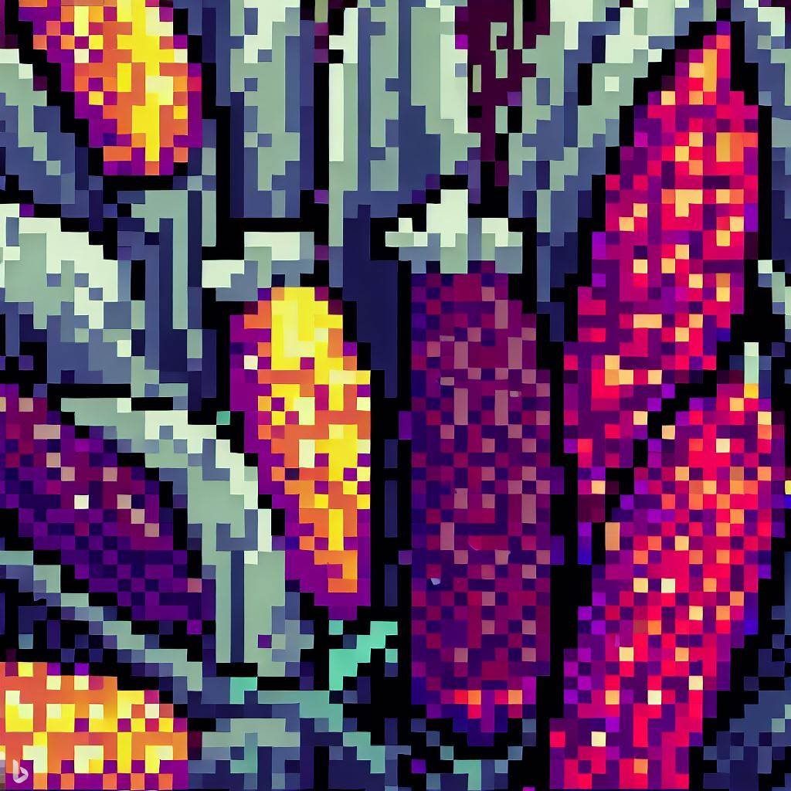

## Proyecto Global de Maíces

+--------------------------------------------------------------------------------------------------------------------------------------------------------------------------------------------------------------------------------------------------------------------------------------------------------------------------------------------------------------------------------------------------------------------------------------------------------------------------------------------------------------------------------------------------------------------------------------------------------------------------------------------------------------------------------------------------------------------------+-------------------------------------------------------------------------------------------------------------------------+
| El **Proyecto Global de Maíces (PGM)** un proyecto de investigación realizado por la Comisión Nacional para el Conocimiento y Uso de la Biodiversidad (CONABIO) en México. El objetivo del PGM fue actualizar la información sobre el maíz y sus parientes silvestres en México, con el fin de determinar los centros de origen y diversidad genética del maíz. Los resultados del PGM fueron un paso significativo hacia el cumplimiento de los requisitos de los artículos 86 a 88 de la LBOGM (Ley de Bioseguridad de Organismos Genéticamente Modificados). El PGM también permitió la recolección y actualización de información, que reveló que México tiene 64 razas de maíz, de las cuales 59 son razas nativas. | [{width="500"}](https://www.biodiversidad.gob.mx/diversidad/proyectoMaices) |
|                                                                                                                                                                                                                                                                                                                                                                                                                                                                                                                                                                                                                                                                                                                          |                                                                                                                         |
| Con esta aplicación web pretendemos dar a conocer con más detalle algunos de los resultados del PGM. La aplicación permite a los usuarios ver mapas de la diversidad del maíz en México, aprender acerca de los distintos complejos raciales de maíz y acceder a información sobre la diversidad genética del maíz. Además, la aplicación proporciona a los usuarios recursos sobre cómo conservar y promover el uso de las variedades nativas de maíz.                                                                                                                                                                                                                                                                  |                                                                                                                         |
+--------------------------------------------------------------------------------------------------------------------------------------------------------------------------------------------------------------------------------------------------------------------------------------------------------------------------------------------------------------------------------------------------------------------------------------------------------------------------------------------------------------------------------------------------------------------------------------------------------------------------------------------------------------------------------------------------------------------------+-------------------------------------------------------------------------------------------------------------------------+
