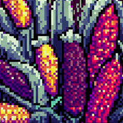

<table>
<colgroup>
<col style="width: 50%" />
<col style="width: 50%" />
</colgroup>
<tbody>
<tr class="odd">
<td style="text-align: center;">

El <strong>Proyecto Global de Maíces (PGM)</strong> un proyecto de investigación realizado por la Comisión Nacional para el Conocimiento y Uso de la Biodiversidad (CONABIO) en México. El objetivo del PGM fue actualizar la información sobre el maíz y sus parientes silvestres en México, con el fin de determinar los centros de origen y diversidad genética del maíz. Los resultados del PGM fueron un paso significativo hacia el cumplimiento de los requisitos de los artículos 86 a 88 de la LBOGM (Ley de Bioseguridad de Organismos Genéticamente Modificados). El PGM también permitió la recolección y actualización de información, que reveló que México tiene 64 razas de maíz, de las cuales 59 son razas nativas.

</td>
<td style="text-align: center;">

</td>
</tr>
</tbody>
</table>

Con esta aplicación web pretendemos dar a conocer con más detalle algunos de los resultados del PGM. La aplicación permite a los usuarios ver mapas de la diversidad del maíz en México, aprender acerca de los distintos complejos raciales de maíz y acceder a información sobre la diversidad genética del maíz. Además, la aplicación proporciona a los usuarios recursos sobre cómo conservar y promover el uso de las variedades nativas de maíz.
